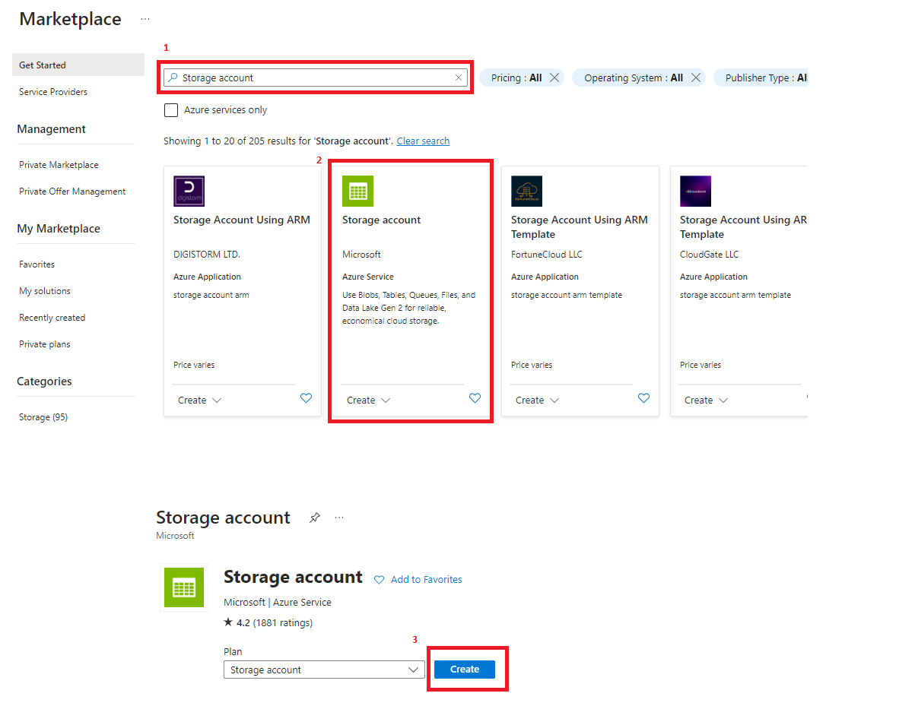
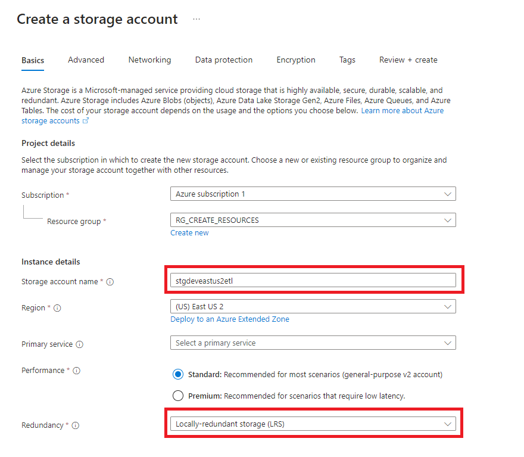
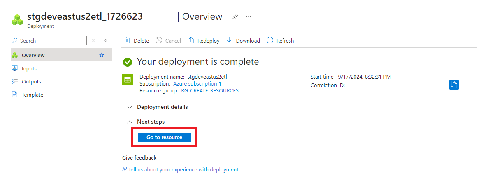
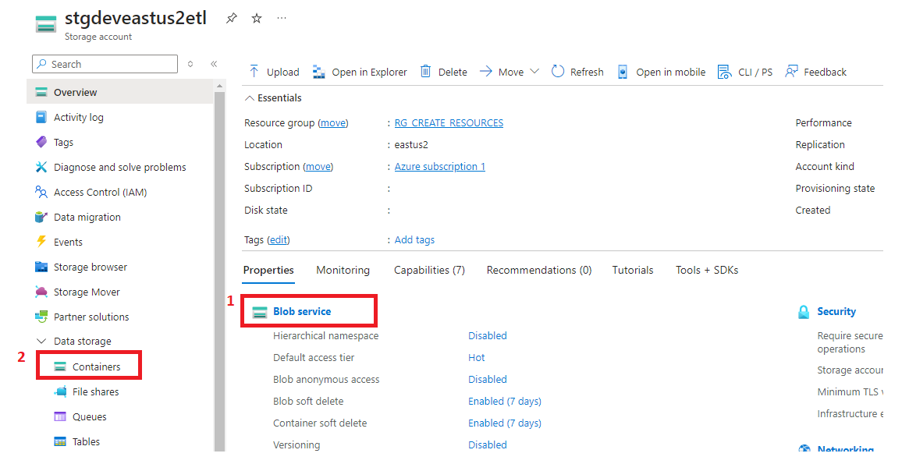
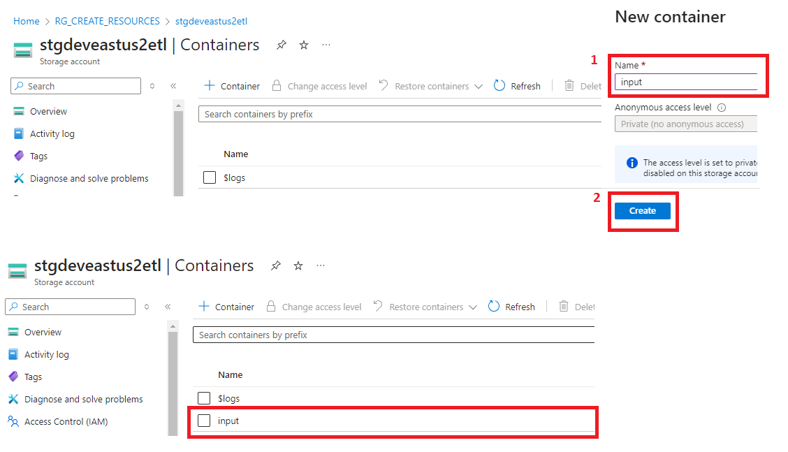

  ## 3. Azure Blob Service:
  <h3 style="margin-left: 1em;">3.1 Para crear un Azure Blob Storage dar click en <strong>Create</strong></h3>
    

  <h3 style="margin-left: 1em;">3.2 En el buscador escribimos Storage account y elegimos el servicio, luego dar click en <strong>(Create)</strong></h3>
    

  <h3 style="margin-left: 1em;">3.3 Asignamos un nombre acorde a la tarea que se quiere realizar</h3>
    

  <h3 style="margin-left: 1em;">3.4 Dar click en <strong>Go to resource</strong></h3>
    

  <h3 style="margin-left: 1em;">3.5 Dar click en <strong>Blob service</strong>, luego en <strong>Containers</strong></h3>
    

  <h3 style="margin-left: 1em;">3.6 Asignamos un nombre al contenedor y damos click en <strong>Create</strong></h3>
  
     