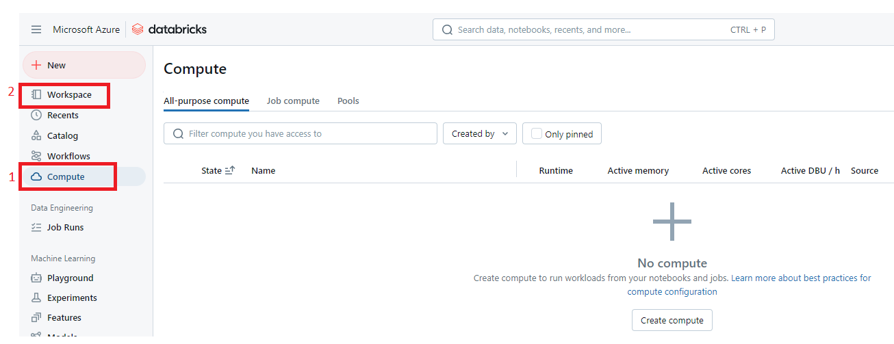

  ## 5. Azure Databricks:
  <h3 style="margin-left: 1em;">5.1 Para crear un Azure Databricks dar click en <strong>Create</strong></h3>
    

  <h3 style="margin-left: 1em;">5.2 En el buscador escribimos Azure Databricks y elegimos el servicio, luego dar click en <strong>(Create)</strong></h3>
    

  <h3 style="margin-left: 1em;">5.3 Asignamos un nombre acorde a la tarea que se quiere realizar, luego <strong>Review + create<strong></h3>
    

  <h3 style="margin-left: 1em;">5.4 Dar click en <strong>Go to resource<strong></h3>
    

  <h3 style="margin-left: 1em;">5.5 Dar click en <strong>Launch Workspace</strong></h3>
    

  <h3 style="margin-left: 1em;">5.6 En la opción <strong>Compute</strong> podemos los clusteres, en <strong>Workspace</strong> podemos crear nuestros notebooks</h3>
  
     