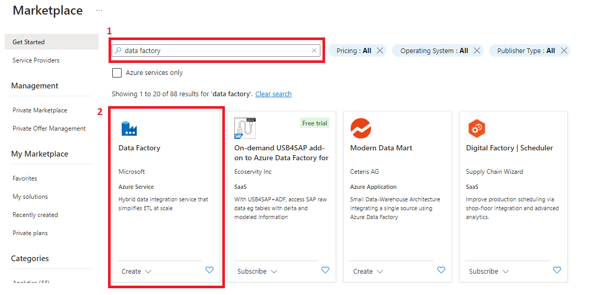
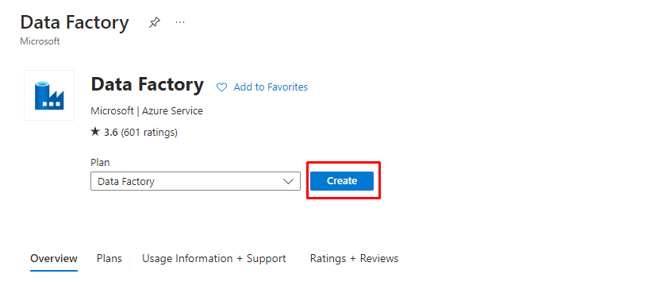
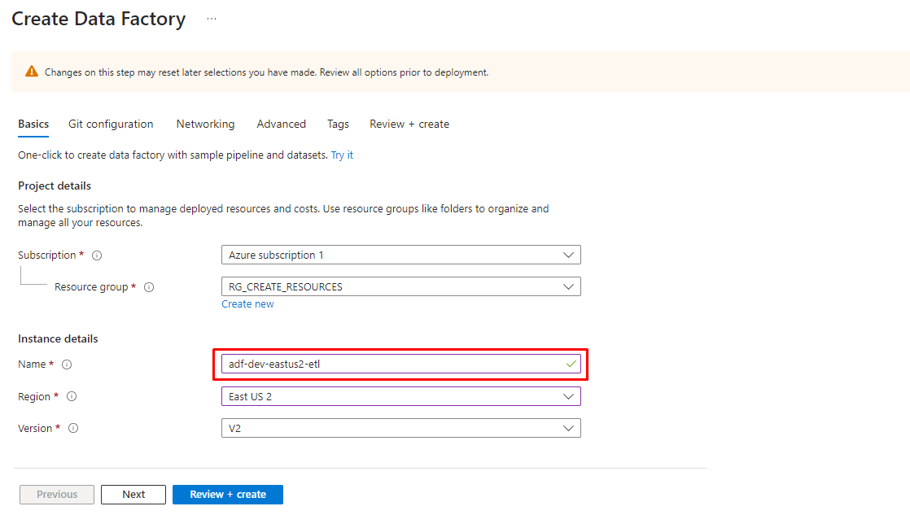
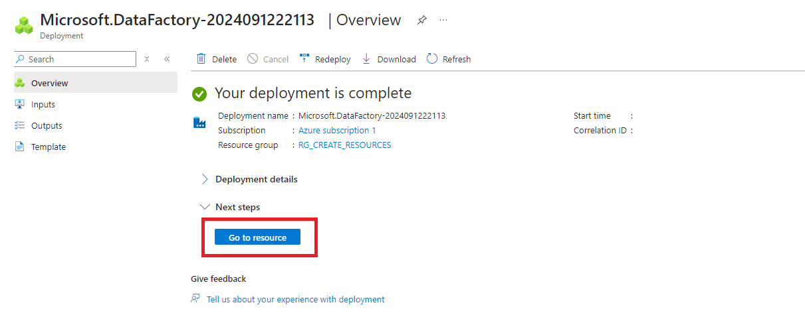
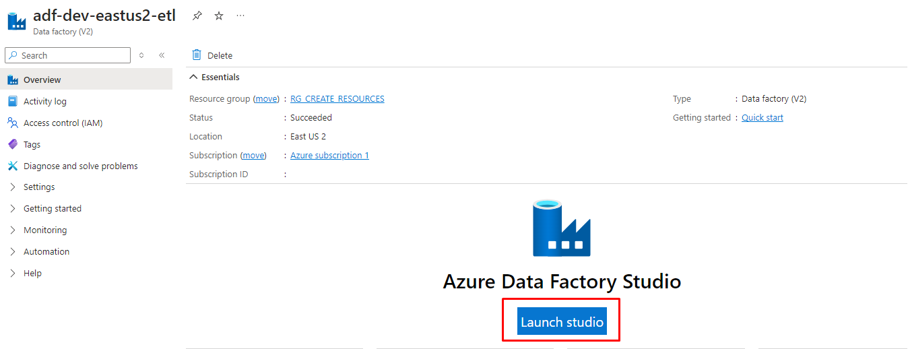
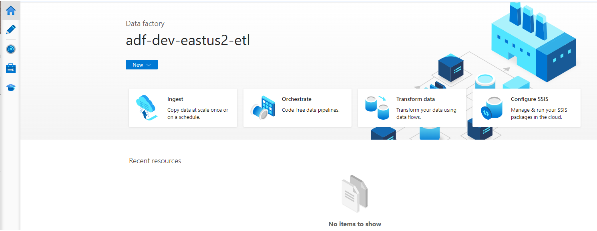

## 2. Azure Data Factory:
  <h3 style="margin-left: 1em;">2.1 Para crear un Azure Datafactory dar click en <strong>Create</strong></h3>
    

  <h3 style="margin-left: 1em;">2.2 En el buscador escribimos data factory y elegimos el servicio data factory <strong>(Create)</strong></h3>
    

  <h3 style="margin-left: 1em;">2.3 Dar click en <strong>Create</strong></h3>
    

  <h3 style="margin-left: 1em;">2.4 Asignamos un nombre acorde a la tarea que se quiere realizar, luego <strong>Review + create<strong></h3>
    

  <h3 style="margin-left: 1em;">2.5 Dar click en <strong>Go to resource</strong></h3>
    

  <h3 style="margin-left: 1em;">2.6 Dar click en <strong>Launch studio</strong></h3>
    

  <h3 style="margin-left: 1em;">2.7 Visualizamos que se creó el servicio Azure Data Factory</h3>
  
     