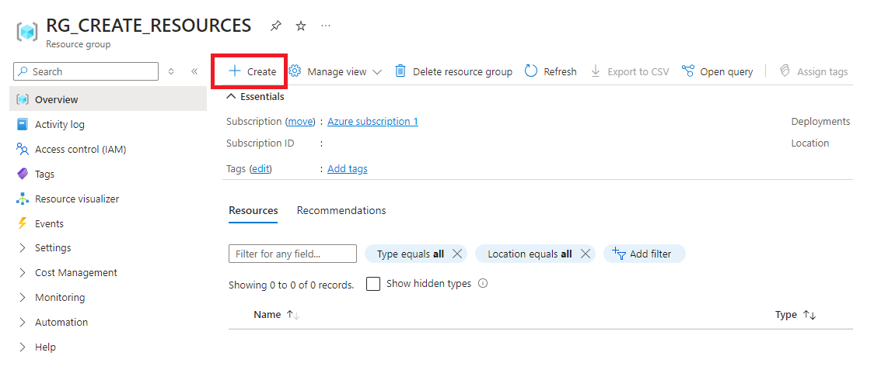

  ## 4. Azure Data Lake Storage Gen2:
  <h3 style="margin-left: 1em;">4.1 Para crear un Azure Data Lake Storage Gen2 dar click en <strong>Create</strong></h3>
    

  <h3 style="margin-left: 1em;">4.2 En el buscador escribimos Storage account y elegimos el servicio, luego dar click en <strong>(Create)</strong></h3>
    

  <h3 style="margin-left: 1em;">4.3 En la pestaña <strong>Basic</strong> Asignamos un nombre acorde a la tarea que se quiere realizar</h3>
    

  <h3 style="margin-left: 1em;">4.4 En la pestaña <strong>Advanced</strong> seleccionamos <strong>Enabled hierarchical namespace</strong>, esta selección convierte de un blob storage a un Data lake</h3>
    

  <h3 style="margin-left: 1em;">4.5 Dar click en <strong>Go to resource</strong></h3>
    

  <h3 style="margin-left: 1em;">4.6 Dar click en <strong>Data Lake Storage</strong>, luego en <strong>Containers</strong></h3>
    

  <h3 style="margin-left: 1em;">4.7 Asignamos un nombre al contenedor y damos click en <strong>Create</strong></h3>
  
     