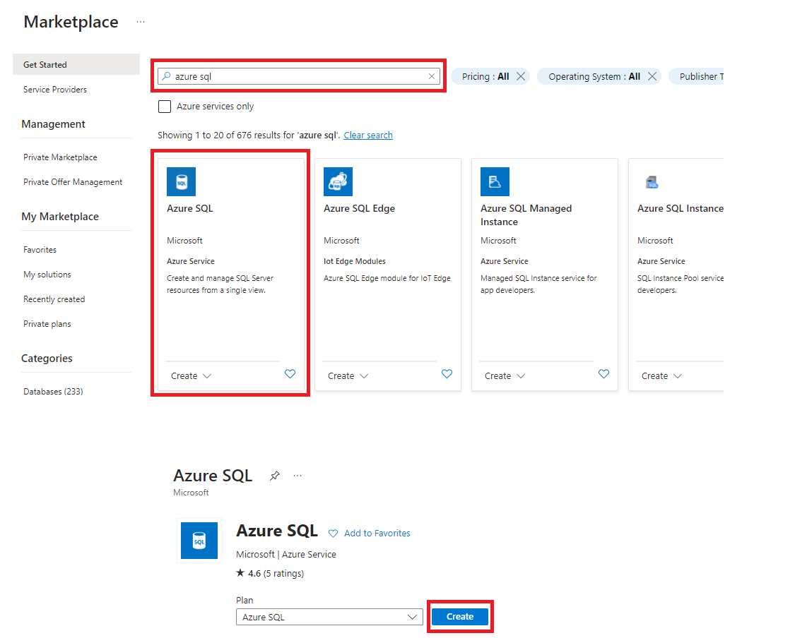
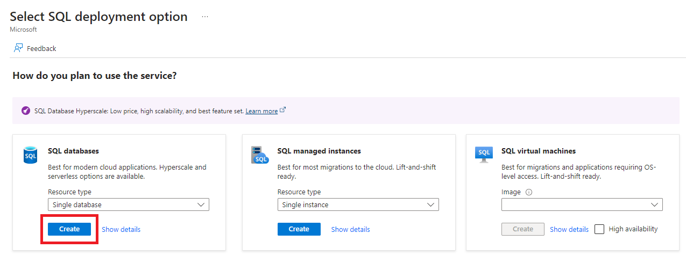
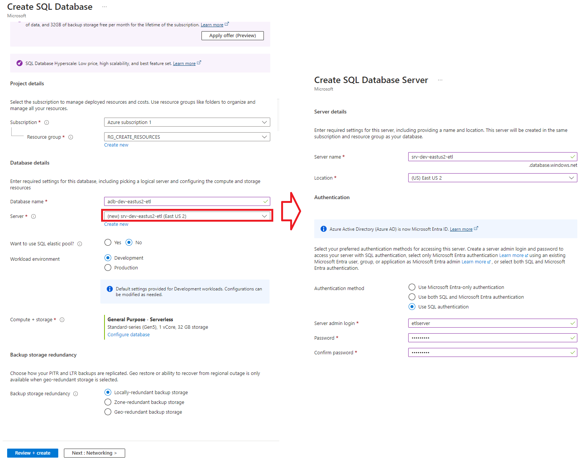
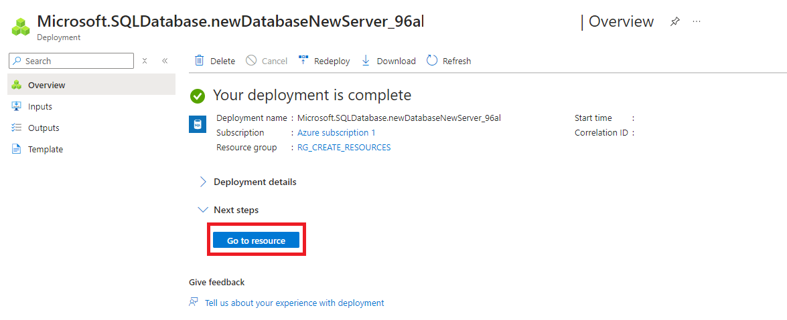
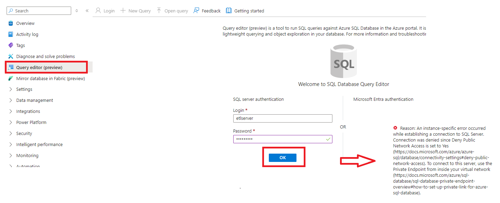
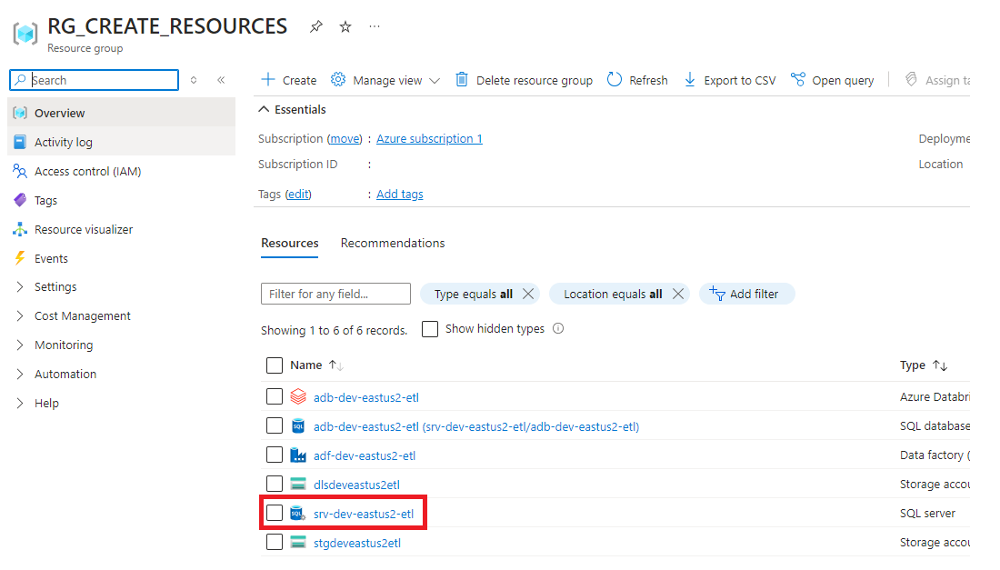
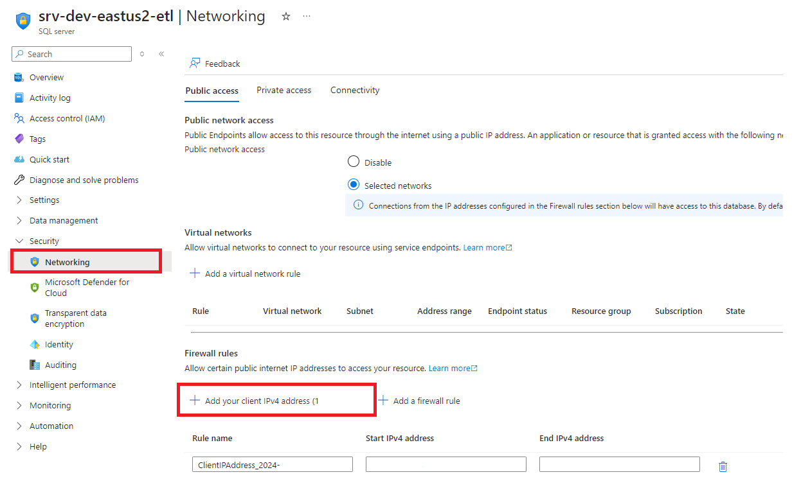
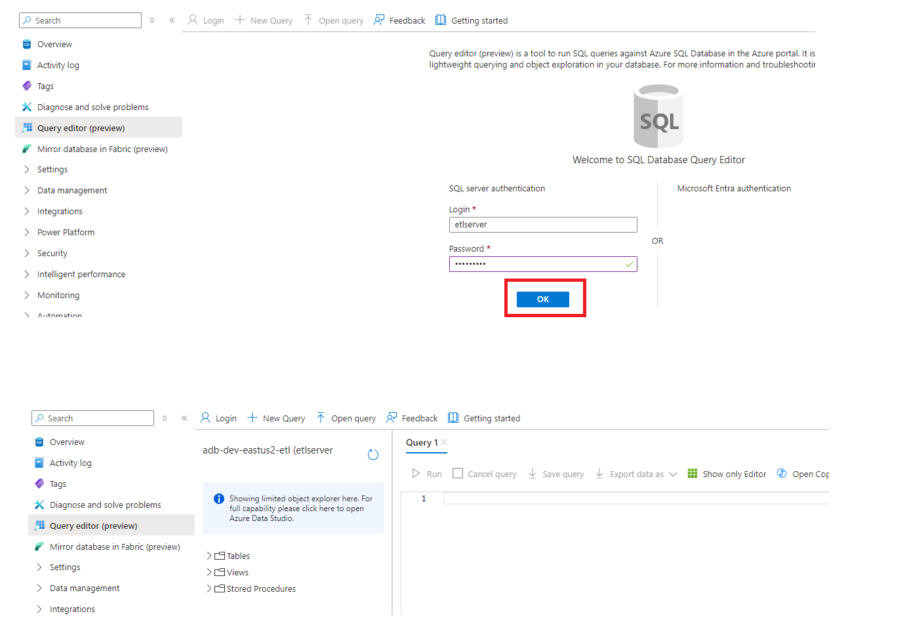

  ## 6. Azure SQL:
  <h3 style="margin-left: 1em;">6.1 Para crear un Azure SQL dar click en <strong>Create</strong></h3>
    

  <h3 style="margin-left: 1em;">6.2 En el buscador escribimos Azure SQL y elegimos el servicio, luego dar click en <strong>(Create)</strong></h3>
    

  <h3 style="margin-left: 1em;">6.3 Elegimos Single database, luego <strong>Create</strong></h3>
    

  <h3 style="margin-left: 1em;">6.4 Creamos el database y su servidor donde estara alojado</h3>
    

  <h3 style="margin-left: 1em;">6.5 Dar click en <strong>Go to resource<strong></h3>
    

  <h3 style="margin-left: 1em;">6.6 Nos conectamos a la base de datos, si aparece el siguiente error vamos al paso <strong>6.7<strong></h3>
    

   <h3 style="margin-left: 1em;">6.7 Seleccionamos el servicio <strong>Servidor de base dedatos<strong></h3>
    

   <h3 style="margin-left: 1em;">6.8 Registramos nuestra IP</h3>
    

   <h3 style="margin-left: 1em;">6.9 Ahora ya podremos acceder a la base de datos</h3>
    
     