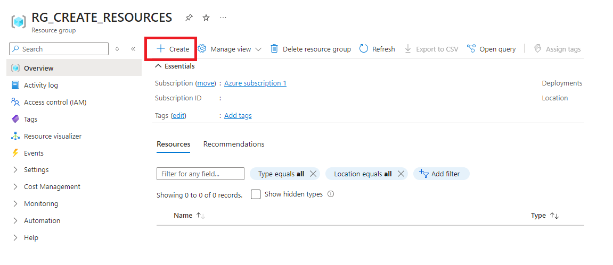
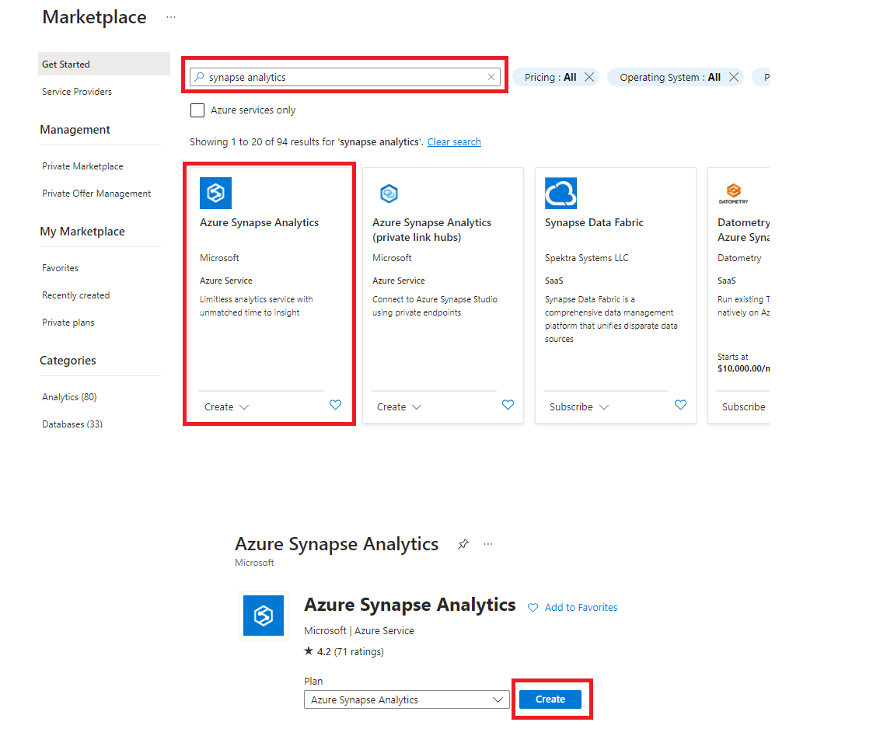
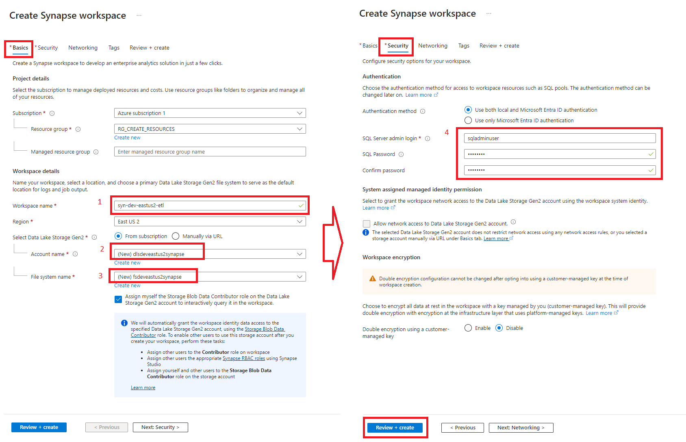
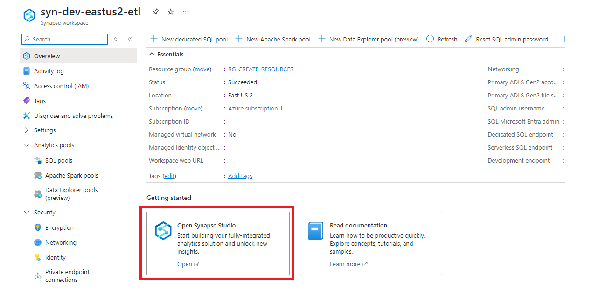
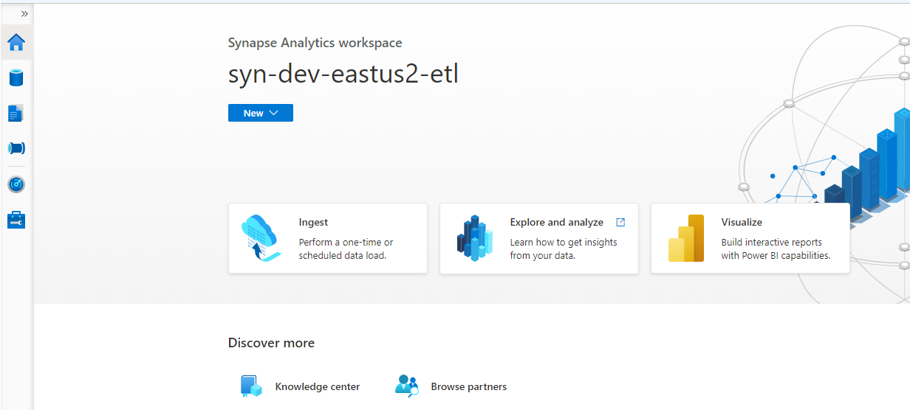

  ## 7. Azure Synapse Analytics:
  <h3 style="margin-left: 1em;">7.1 Para crear un Azure SQL dar click en <strong>Create</strong></h3>
    

  <h3 style="margin-left: 1em;">7.2 En el buscador escribimos Synapse Analytics y elegimos el servicio, luego dar click en <strong>(Create)</strong></h3>
    

  <h3 style="margin-left: 1em;">7.3 En la pestaña <strong>Basics</strong>, asignar un nombre al workspace, datalake y filesystem,  en la pestaña <strong>Security</strong> asignar las credenciales de la base de datos, luego <strong>Review + Create</strong></h3>
    

  <h3 style="margin-left: 1em;">7.4 Dar click en <strong>Go to resource group</strong></h3>
    

  <h3 style="margin-left: 1em;">7.5 Dar click en <strong>Open Synapse Studio</strong></h3>
    

  <h3 style="margin-left: 1em;">7.6 Nos muestra el panel de Azure Synapse Analytics</h3>
    
     