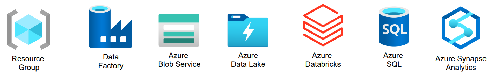

# Crear recursos Azure para ETL

   

1. **Resource Group**: Contenedor lógico para administrar recursos de Azure.
2. **Azure Data Factory**: Para Orquestación, movimiento y transformación de datos.
3. **Azure Blob Service**: Para Almacenamiento de objetos no estructurados en la nube.
4. **Azure Data Lake Storage Gen2**:  Para Almacenamiento optimizado para big data y análisis.
5. **Azure Databricks**: Plataforma de análisis y machine learning basada en Spark.
6. **Azure SQL**: Base de datos relacional totalmente gestionada en la nube.
7. **Azure Synapse Analytics**: Plataforma unificada para análisis de big data y almacenamiento de datos.
  
---
 

### **Resource Group :** [README-RG.md](Resource_Group/README-RG.md)
* Crear un Resource Group

### **Azure Data Factory :** [README-ADF.md](Azure_Datafactory/README-ADF.md)
* Crear servicio Azure Datafactory

### **Azure Blob Service :** [README-ABS.md](Azure_Blobservice/README-ABS.md)
* Crear servicio Azure blob Service
* Crear un contenedor

### **Azure Data Lake Storage Gen2 :** [README-ADL.md](Azure_Datalake/README-ADL.md)
* Crear el servicio Azure Data Lake Storage
* Crear un contenedor

### **Azure Databricks :** [README-ADB.md](Azure_Databricks/README-ADB.md)
* Crear un Azure Databricks

### **Azure SQL :** [README-ASQL.md](Azure_Sql/README-ASQL.md)
* Crear el servicio Azure SQL
* Asignar nuestra IP para acceder a la BD

### **Azure Synapse Analytics :** [README-ASA.md](Azure_Synapse/README-ASA.md)
* Crear el servicio Azure Synapse Analytics