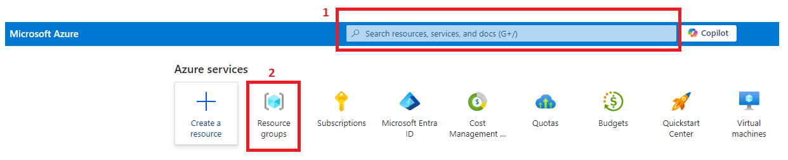
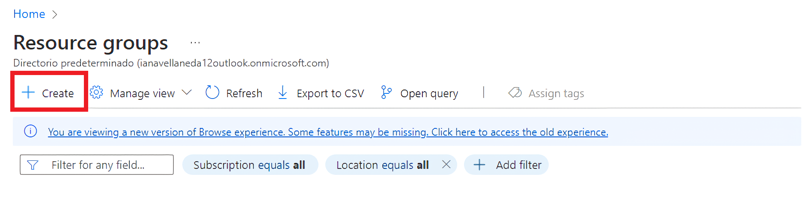
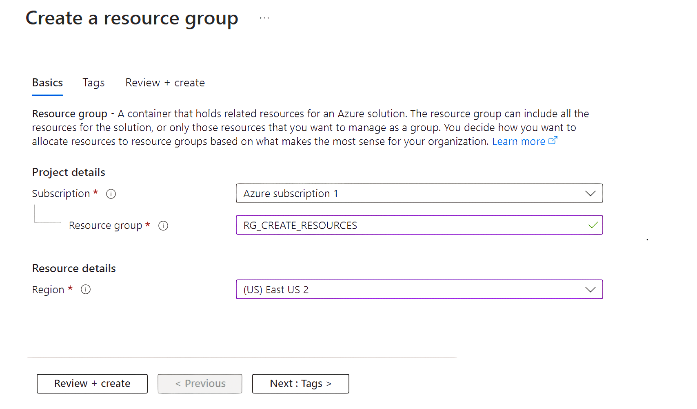
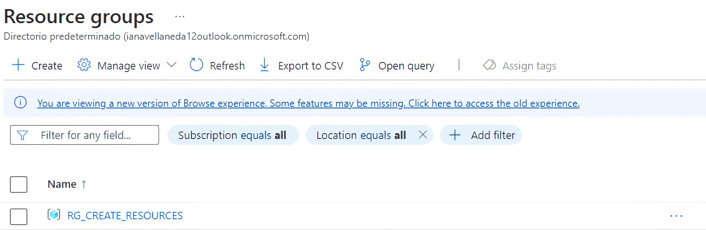

## 1. Resource Group:
  <h3 style="margin-left: 1em;">1.1 Podemos escribir <strong>resource group</strong> en la caja de texto o dar click en el ícono</h3>
    

  <h3 style="margin-left: 1em;">1.2 Dar click en <strong>Create</strong></h3>
    

  <h3 style="margin-left: 1em;">1.3 Asignamos un nombre al resource group, para este caso <strong>RG_CREATE_RESOURCES</strong>, damos click en <strong>Review + create</strong>, luego en <strong>Create</strong></h3>
    

  <h3 style="margin-left: 1em;">1.4 Visualizamos que se creo el Resource group</h3>
  
     